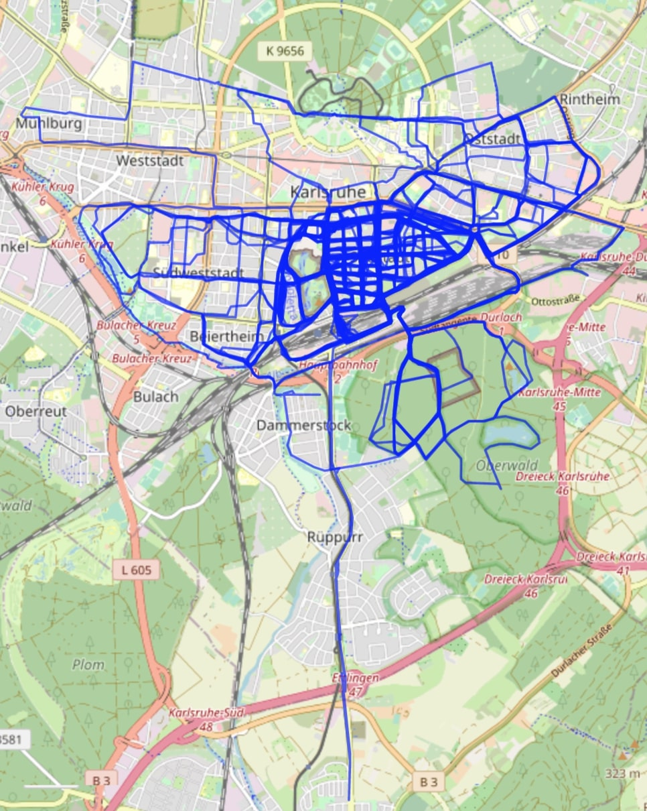
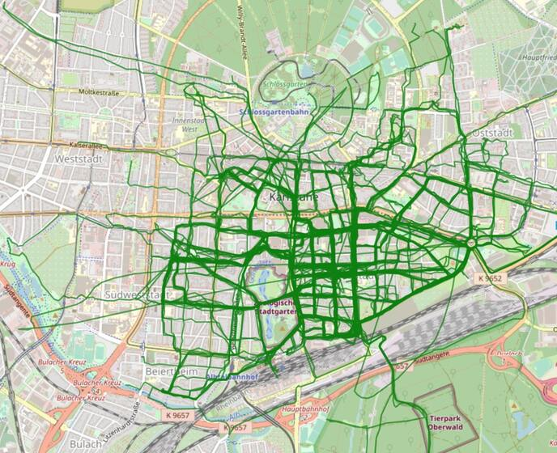
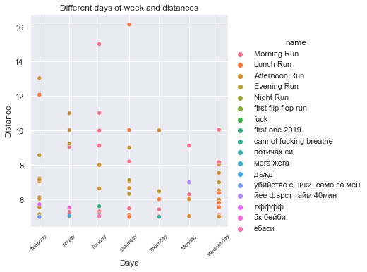
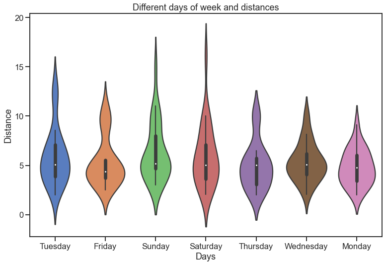
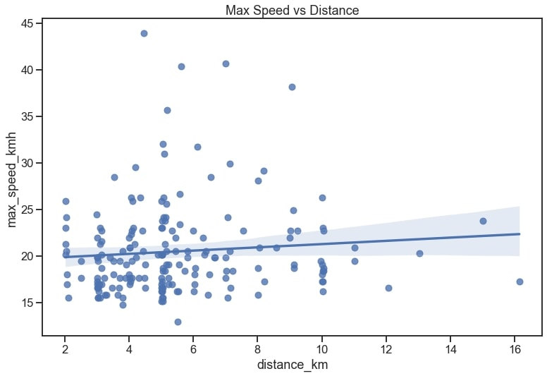
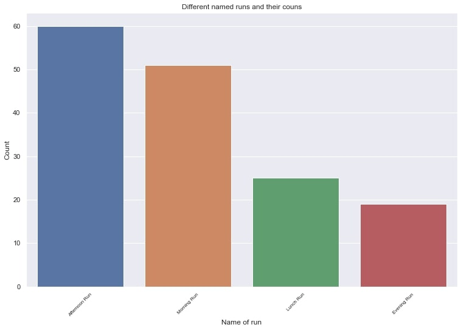
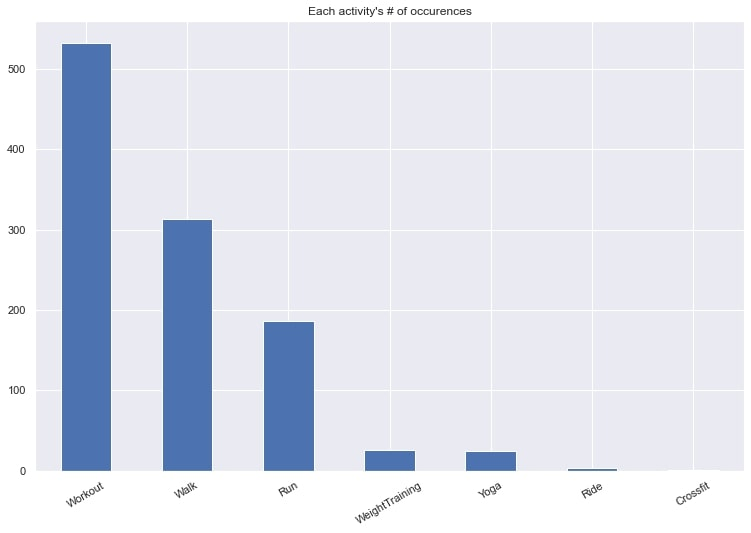

>
>
>

>
>
>
>
>

## Tutorials
Tutorial to follow:  
https://towardsdatascience.com/using-the-strava-api-and-pandas-to-explore-your-activity-data-d94901d9bfde  
Video walkthrough:  
https://www.youtube.com/watch?v=2FPNb1XECGs&list=PLO6KswO64zVvcRyk0G0MAzh5oKMLb6rTW&index=4  

## Setup
1. create a virtual env with python version >=3.7.7.
2. `pip install -r requirements.txt`.
3. - either run `jupyter notebook` to run `strava_activities.ipynb`. 
   - or just run `python3 strava_acts.py`
4. when you have clean run.csv and walk.csv files you can move further.
5. to start the Flask instance - run in terminal `python3 app.py`.
6. open your browser using ULR: `http://127.0.0.1:5001/`.

## strava_activities.ipynb
- Getting all available activities from Strava. 
- Original raw DataFrame is saved to a .csv file.  
- `Run` & `Walk` - Activities are filtered and saved separately for routes visualizations. 
- Raw Activities dataset is converted to a Pandas DataFrame and columns are renamed and certain values converted. Data is then ready to be visualized. 

## templates/leaflet_*.html 
- `app.py` reads run/walk.csvs, takes polyline information and forwards it to the 2 template files - one for each activity - to visualize them.

## DONE
- [x] Welcome message based on the time of the day.  
- [x] Locations drop-down menu with 2 buttons, one for Veliko Tarnovo and one for Karlsruhe. It just saves time dragging from one location to the other, and vice-versa. 
- [x] 2 new buttons. Walks/Runs, each one appears next to the drop-down menu. Redirects automatically instead of changing the link manually 

## TODO
- [ ] overlay all run and walk workouts with different colors.
