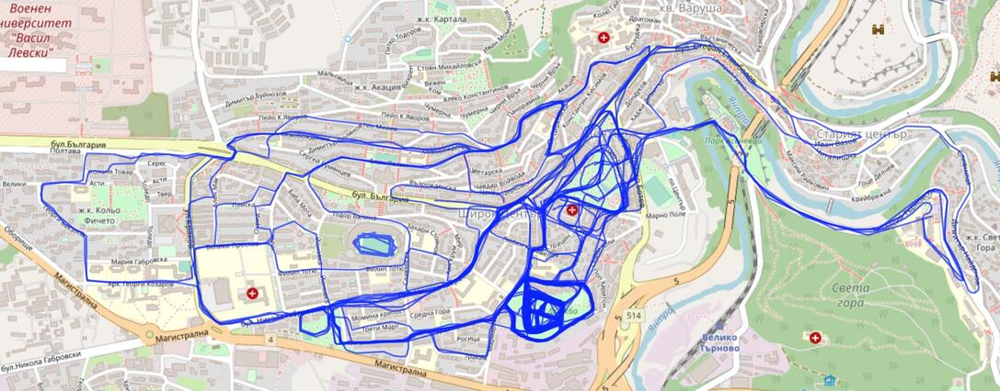

>
>
>

>
>
>
>

## tutorials
Tutorial to follow:  
https://towardsdatascience.com/using-the-strava-api-and-pandas-to-explore-your-activity-data-d94901d9bfde  
Video walkthrough:  
https://www.youtube.com/watch?v=2FPNb1XECGs&list=PLO6KswO64zVvcRyk0G0MAzh5oKMLb6rTW&index=4  

## strava_running
- Tries getting 99 pages each with 200 activities. (if so many exist) 
- Original raw DataFrame is saved to a .csv file.  
- `Run` & `Walk` are filtered and saved raw.  
- Cleanup run/walk and save again. Activities dataset is converted to a Pandas DataFrame and columns are renamed and certain values converted.  
- After the cleanup process only a certain amount of columns are taken for the next step (this can be easily changed). 
- The cleaned DataFrame is saved to a .csv file.  
- Data is again read and visualized with different kind of graphs (seaborn)  

## leaflet_walk.html / leaflet_run.html 
- these 2 files are visualizing the information that is being taken from the .csv files with the help of `app.py` file.

## startup
- To start the Flask instance - run in terminal `python app.py`.  
- Open your browser http://127.0.0.1:5001/X , X can be runs or walks.  
